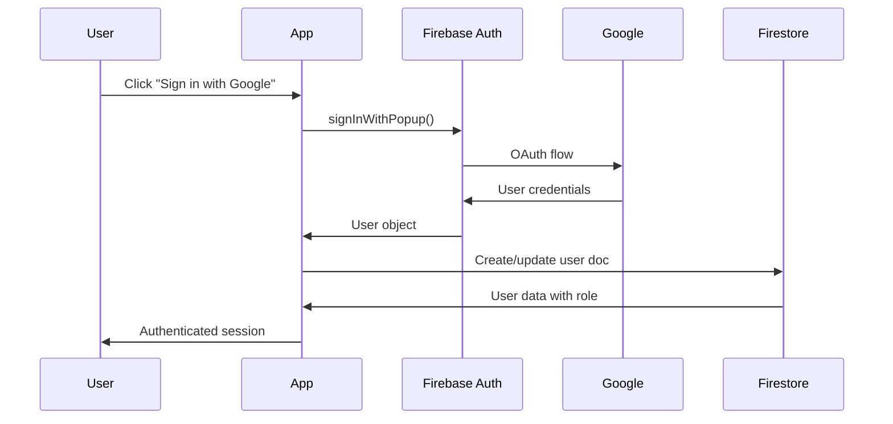

# Security Considerations

## Authentication & Authorization

### Auth Flow


### Role-Based Access
| Role | Permissions |
|------|-------------|
| Guest | View products, landing page |
| User | View own orders, referrals, profile; Create orders |
| Admin | All user permissions + manage orders, products, referrals, settings |

### Admin Detection
```typescript
// Admin is determined by email
const ADMIN_EMAIL = "yursccc@gmail.com";

function isAdmin(user: User): boolean {
  return user.email === ADMIN_EMAIL || user.role === "admin";
}
```

## Sensitive Data
| Data Type | Storage | Encryption | Access |
|-----------|---------|------------|--------|
| User email | Firestore | Firebase managed | User + Admin |
| Phone number | Firestore | Firebase managed | User + Admin |
| Firebase config | Source code | None (public keys) | Public |
| Order history | Firestore | Firebase managed | User (own) + Admin |

## Firestore Security Rules

See `/firestore.rules` for complete rules. Summary:

| Collection | Read | Write |
|------------|------|-------|
| users | Owner or Admin | Owner or Admin |
| products | Public | Admin only |
| orders | Owner or Admin | Create: Owner, Update: Admin |
| referrals | Owner or Admin | Create: Authenticated, Update: Admin |
| settings | Public | Admin only |

## Security Checklist
- [x] Input validation on user inputs (phone, etc.)
- [x] Firestore security rules implemented
- [ ] Rate limiting (Firebase handles basic, custom needed for abuse)
- [x] HTTPS enforced (Cloudflare)
- [x] Secure headers (Cloudflare defaults)
- [x] Auth via OAuth (no password storage)
- [ ] Firebase security rules testing

## Known Vulnerabilities
| Issue | Risk | Mitigation |
|-------|------|------------|
| Firebase config in source | Low | These are public API keys, restricted by domain |
| No CSRF protection | Low | Using Firebase Auth handles this |
| No rate limiting on API | Medium | Add Cloud Functions for rate limiting if needed |

## Security Best Practices

### For Developers
1. Never commit actual secrets to git
2. Use environment variables for sensitive config in production
3. Regularly audit Firestore rules
4. Monitor Firebase usage for anomalies

### For Admins
1. Use strong passwords for Google account
2. Enable 2FA on admin Google account
3. Regularly review referral payouts for fraud
4. Monitor order patterns for suspicious activity
