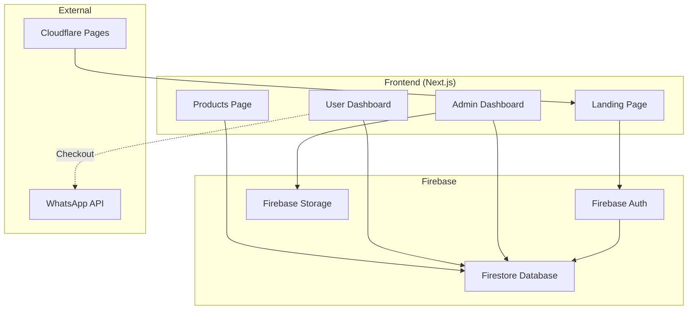

# System Overview

## What is Actually Built & Running

### Architecture Diagram


### Technology Stack
| Layer | Technology | Version | Purpose |
|-------|------------|---------|---------|
| Frontend | Next.js | 16.1.6 | React framework with App Router |
| Styling | Tailwind CSS | v4 | Utility-first CSS |
| Auth | Firebase Auth | Latest | Google Sign-In |
| Database | Firestore | Latest | NoSQL database |
| Storage | Firebase Storage | Latest | Product images |
| Hosting | Cloudflare Pages | - | Static site hosting |
| Icons | Lucide React | Latest | UI icons |

### Infrastructure
| Component | Provider | Details |
|-----------|----------|---------|
| Hosting | Cloudflare Pages | Static export, global CDN |
| Database | Firebase Firestore | NoSQL, real-time sync |
| Storage | Firebase Storage | Product image uploads |
| Auth | Firebase Auth | Google OAuth provider |
| Domain | innovarc.uk | Custom domain on Cloudflare |

### External Dependencies
| Service | Purpose | Criticality |
|---------|---------|-------------|
| Firebase | Auth, Database, Storage | High |
| Cloudflare | Hosting, DNS | High |
| WhatsApp | Order checkout | Medium |
| Google OAuth | User login | High |

### Current State
- **Version**: 1.0.0
- **Environment**: Production
- **Last Deploy**: 2026-02-01
- **URL**: https://innovarc.uk

## Database Schema

### Users Collection
```typescript
interface User {
  uid: string;
  email: string;
  displayName: string;
  phone?: string;
  role: "user" | "admin";
  referralCode: string;
  referredBy?: string;
  createdAt: Timestamp;
}
```

### Products Collection
```typescript
interface Product {
  id: string;
  name: string;
  category: "3d-print" | "mug" | "tshirt";
  price: number;
  imageUrl: string;
  description: string;
  createdAt: Timestamp;
}
```

### Orders Collection
```typescript
interface Order {
  id: string;
  userId: string;
  items: { name: string; price: number; quantity: number }[];
  total: number;
  status: "pending" | "processing" | "delivered";
  createdAt: Timestamp;
}
```

### Referrals Collection
```typescript
interface Referral {
  id: string;
  referrerId: string;
  refereeId: string;
  commission: number;
  status: "pending" | "paid";
  createdAt: Timestamp;
}
```

### Settings Document
```typescript
interface Settings {
  commissionPercent: number;
  whatsappNumber: string;
}
```
