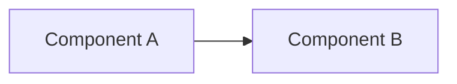

# Technical Design: [Feature Name]

## Overview
<!-- High-level approach -->

## Architecture


## Data Model
<!-- New or modified data structures -->
```typescript
interface Example {
  id: string;
  name: string;
}
```

## API Changes
| Endpoint | Method | Description |
|----------|--------|-------------|
| | | |

## Implementation Steps
1. Step 1
2. Step 2
3. Step 3

## Dependencies
- [ ] Dependency 1
- [ ] Dependency 2

## Risks & Mitigations
| Risk | Mitigation |
|------|------------|
| | |

## Alternatives Considered
| Option | Pros | Cons | Decision |
|--------|------|------|----------|
| | | | ✅/❌ |
